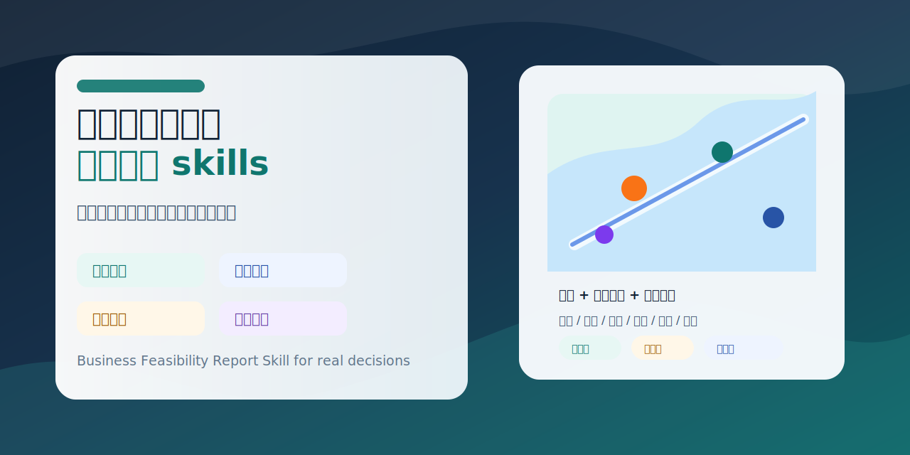
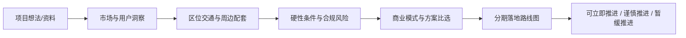
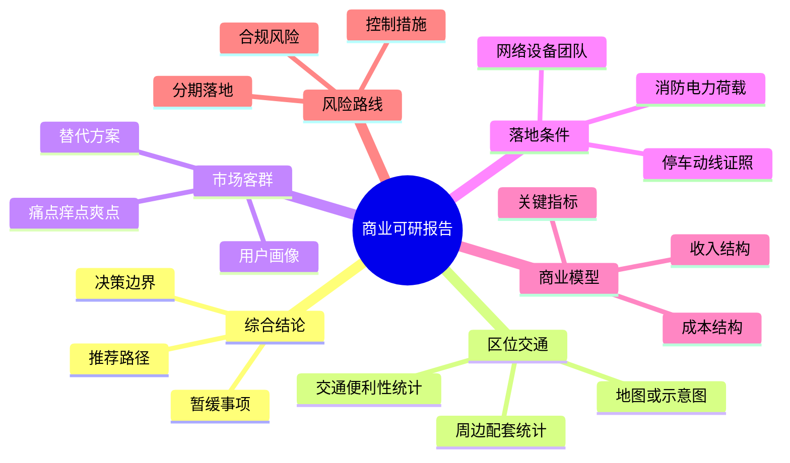
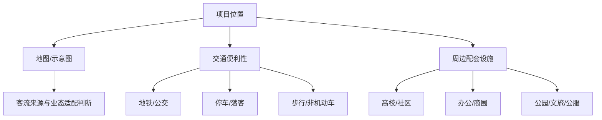

# 商业可行性报告一键生成skills



<p align="center">
  <a href="https://github.com/liujialang23-blip/KeYan-Business-Feasibility-Skill/stargazers"></a>
  
  
  
</p>

> 商业可行性报告一键生成skills、商业可行性报告、可研报告、商业可研、Business Feasibility Report Skill、AI feasibility report。

一个面向真实商业决策的 AI Skill：把一个项目、产品、园区、门店、服务、新业态或投资机会，转化为一份可判断、可验证、可执行的商业落地可行性报告。

它不只写“市场前景很好”的泛泛分析，而是强制把结论落到区位交通、周边配套、用户需求、硬性条件、商业模式、政策合规、风险边界和分期行动。

## 一句话

把“这个项目能不能做”变成一份能拿去讨论、招商、立项、验证和分工的可研报告。



## 为什么值得用

很多 AI 商业报告看起来很满，但真正决策时会卡在现实问题上：

| 常见空洞 | 这个 Skill 会补上 |
|---|---|
| 只讲趋势，不讲边界 | 明确已确认、初步判断、需复核 |
| 只说“地段好” | 统计地铁、公交、停车、步行、网约车、后勤 |
| 忽略周边客流 | 统计高校、社区、办公、商圈、文旅、公服设施 |
| 没有落地图 | 要求地图、点位图、圈层图或交通关系图 |
| 只给一个方向 | 做 2-4 个方案比选 |
| 不讲消防、证照、合规 | 加入硬条件与风险清单 |
| 上来就建议重投入 | 输出分期验证和决策闸门 |

## 适合谁

| 你是谁 | 可以用它做什么 |
|---|---|
| 创业者 | 快速判断一个新项目是否值得投入 |
| 园区运营方 | 做产业定位、招商方向、功能配比和入驻准入 |
| 商业地产团队 | 做门店、街区、园区或文旅空间可研 |
| 品牌方 | 评估新业务、新产品、新服务的落地路径 |
| 咨询/策划团队 | 快速生成第一版可研报告框架和资料清单 |
| 政策申报团队 | 梳理新业态、新模式、新场景的材料缺口 |

## 它会生成什么



## 核心能力

| 模块 | 能力 |
|---|---|
| 综合结论 | 先给判断、边界、推荐路径和暂缓事项 |
| 用户与市场 | 用户画像、痛点/痒点/爽点、核心付费人群、替代方案 |
| 区位交通 | 周边配套设施统计、交通便利性统计、客流来源判断 |
| 地图可视化 | 区位图、配套点位图、交通到达图、距离圈层图或示意图 |
| 硬性条件 | 消防、电力、荷载、排水、停车、动线、证照、网络等 |
| 方案比选 | 2-4 个方向矩阵比较，明确推荐和暂缓路径 |
| 商业模式 | 收入结构、成本结构、运营机制、关键指标 |
| 政策合规 | 许可、备案、内容、食品、住宿、培训、活动等风险边界 |
| 分期落地 | 0-30天、1-3个月、3-6个月、6-12个月、12-24个月路线图 |
| 决策输出 | 可立即推进、谨慎推进、暂缓推进、资料补充清单 |

## 特色：线下项目的地图与交通研判

对园区、门店、商业空间、文旅空间、培训空间、酒店/民宿、社区服务等线下项目，这个 Skill 会强制要求：

- 统计周边高校、社区、办公、商业、餐饮、酒店、公园、景区、医院、停车场等配套设施；
- 统计地铁、公交、主干道、停车、步行、非机动车、网约车落客和后勤装卸条件；
- 至少补充一张地图、点位图、圈层图或交通关系示意图；
- 标注数据来源、测距口径和需要现场复核的边界。



这让报告不再停留在“地段好”这种模糊判断，而是能回答：谁会来、怎么来、能不能停、适合什么业态、不适合什么业态。

## 快速开始

把 `skills/business-feasibility-report` 复制到你的 Codex skills 目录，或在支持 Skill 的平台中导入该目录。

英文调用：

```text
Use $business-feasibility-report to analyze this project and generate a commercial feasibility report.

Project: I want to build an AI creative training and light-office compound near a university district.
Please include the executive conclusion, surrounding facilities, traffic convenience, map visualization suggestions, target users, hard landing conditions, option comparison, business model, risks, and staged roadmap.
```

中文调用：

```text
请使用商业可行性报告一键生成skills，基于我提供的项目资料，生成一份完整可研报告。

报告需要包含：综合结论、区位与周边配套、交通便利性统计、地图或示意图、市场与客群洞察、硬性落地条件、商业模式、政策合规、风险控制、分期实施路径、可立即推进/谨慎推进/暂缓推进建议。
```

## 仓库结构

```text
skills/
└── business-feasibility-report/
    ├── SKILL.md
    ├── agents/
    │   └── openai.yaml
    ├── references/
    │   ├── methodology.md
    │   ├── report-structure.md
    │   ├── feasibility-checklists.md
    │   ├── map-visualization.md
    │   ├── prompt-patterns.md
    │   └── quality-standards.md
    └── assets/
        └── full-report-template.md
```

## 输出效果预览

| 报告章节 | 你会得到什么 |
|---|---|
| 01 综合结论 | 该不该做、先做什么、哪些暂缓 |
| 02 资料依据 | 哪些是事实，哪些只是初步判断 |
| 03 区位交通 | 周边配套、交通便利、地图、客流来源 |
| 04 市场客群 | 核心用户、支付场景、替代方案 |
| 05 硬性条件 | 消防、电力、停车、证照、团队等落地门槛 |
| 06 方案比选 | 多方向矩阵比较 |
| 07 商业模式 | 收入、成本、资源、指标 |
| 08 风险合规 | 风险等级、触发条件、控制措施 |
| 09 分期路径 | 0-30天、1-3个月、3-6个月、6-12个月 |
| 10 决策建议 | 可立即推进、谨慎推进、暂缓推进 |

## Star This Repo

如果你也觉得 AI 不应该只写漂亮报告，而应该帮助真实商业项目少走弯路，欢迎 Star 这个仓库。

你的 Star 会帮助更多创业者、策划人、园区运营方、产品经理和咨询从业者发现它，也会推动这个 Skill 继续加入更多行业模板、地图示例和可研清单。

## Roadmap

- 增加更多行业版模板：餐饮、文旅、社区商业、产业园、AI 产品、培训教育；
- 增加地图可视化示例；
- 增加真实案例脱敏样稿；
- 增加财务测算表格模板；
- 增加中英文双语报告模板；
- 增加适配不同平台的安装说明。

## Author Notes

这个仓库来自一次真实可研报告工作流沉淀，重点吸收了“区位交通、周边配套、硬性条件、招商合规、风险边界、分期实施”的实践经验，并将其整理为可复用的 AI Skill。

如果你用它做出了有价值的报告，欢迎 Star、分享、提 Issue 或提出新的行业模板需求。
