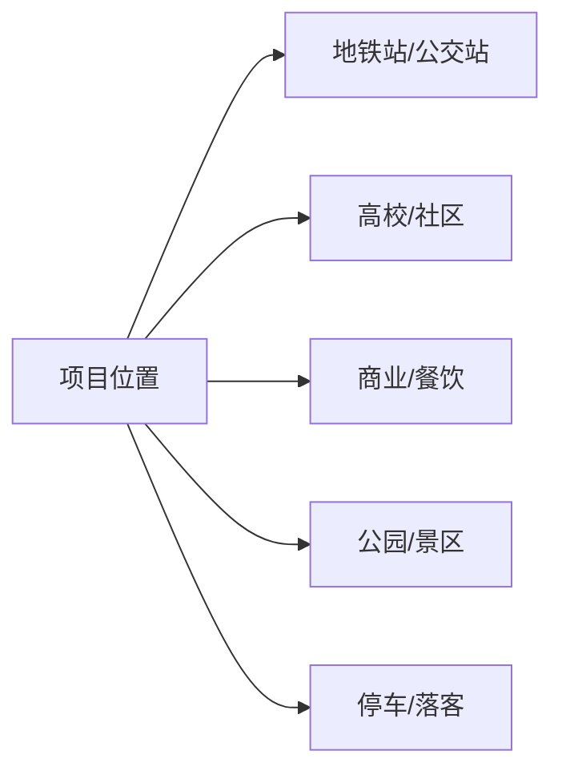

# 地图可视化要求

## When To Create A Map

For parks, stores, campuses, malls, cultural tourism spaces, event venues, training spaces, hotels, community service points, or any project whose feasibility depends on location, create at least one map or schematic.

The purpose is to make周边配套 and交通便利 conditions visible enough to support a real feasibility decision.

## Map Deliverable Types

| Type | Use When | Shows |
|---|---|---|
| 区位关系图 | Need macro location context | City/area relationship, main roads, rail, business districts |
| 周边配套点位图 | Need facility statistics | Schools, communities, offices, commerce, parks, hotels, hospitals, parking |
| 交通到达图 | Need accessibility judgment | Metro, bus, roads, walking path, parking, drop-off |
| 客流来源示意图 | Need operating implications | Resident, student, office, tourist, destination traffic flows |
| 距离圈层图 | Need catchment analysis | 500m, 1km, 3km, 5km influence rings |
| 方位示意图 | Coordinates unavailable | Relative directions and approximate relationships |

## Source Options

Use the best available source:

1. User-provided coordinates, CAD, site plan, address, survey map.
2. Public map or geocoding data such as OpenStreetMap, official transit sources, city open data, or authoritative websites.
3. Manual schematic based on user-provided descriptions when precise data is unavailable.

Always state source and measurement口径. Public map data supports初步判断 only; actual walking time, entrance, parking, congestion, and site access require现场复核.

## Facility Categories

Use consistent categories and labels:

- 教育: universities, schools, training institutions.
- 居住: communities, apartments, dormitories.
- 办公产业: offices, industrial parks, studios, corporate clusters.
- 商业消费: malls, streets, restaurants, cafes, retail, entertainment.
- 文旅休闲: parks, lakes, scenic areas, museums, galleries, art districts.
- 住宿会务: hotels, serviced apartments, conference venues.
- 医疗政务: hospitals, clinics, public services.
- 交通停车: metro, bus, main roads, parking, drop-off, non-motorized parking.

## Map Production Workflow

1. Confirm the project address or coordinate.
2. Choose the map type by decision need.
3. Gather points within the relevant catchment, usually:
   - 500m for walking and immediate retail;
   - 1km for daily pedestrian and cycling reach;
   - 3km for district-level traffic;
   - 5km for broader park, campus, or destination influence.
4. Classify points by category.
5. Add traffic nodes and access paths.
6. Add a legend, scale or distance口径, source note, and复核边界.
7. Insert the image or diagram into the report with a concise interpretation table.

## Minimum Report Table

Pair the map with a table:

| 点位/交通节点 | 类型 | 距离或时间 | 可导入客群 | 对项目影响 | 需复核事项 |
|---|---|---:|---|---|---|

## Fallback Schematics

When exact coordinates or map rendering tools are unavailable:

- Create a Mermaid flowchart showing directional relationships.
- Create a simple distance-ring table and a text schematic.
- Use a handoff note asking the user to provide an address, coordinate, or map screenshot for precise mapping.

Example Mermaid pattern:

## Visual QA

Before final delivery, check:

- The project point is visually prominent.
- Categories are distinguishable.
- The map supports a decision, not decoration.
- Labels do not overlap enough to block reading.
- The report explains what the map means for客流,招商,业态,停车,运营.
- The data source and复核边界 are visible near the map.

## Interpretation Rules

- A nearby metro station improves reach, but actual entrance distance and walking comfort matter.
- A nearby university provides potential youth traffic, not automatic consumption.
- A park or lake supports leisure scenes, but weather and parking can limit conversion.
- Parking scarcity can make high-turnover restaurant, event, and training models risky.
- Good public transit can support office, training, and light retail, but heavy goods and catering need后勤 access.
